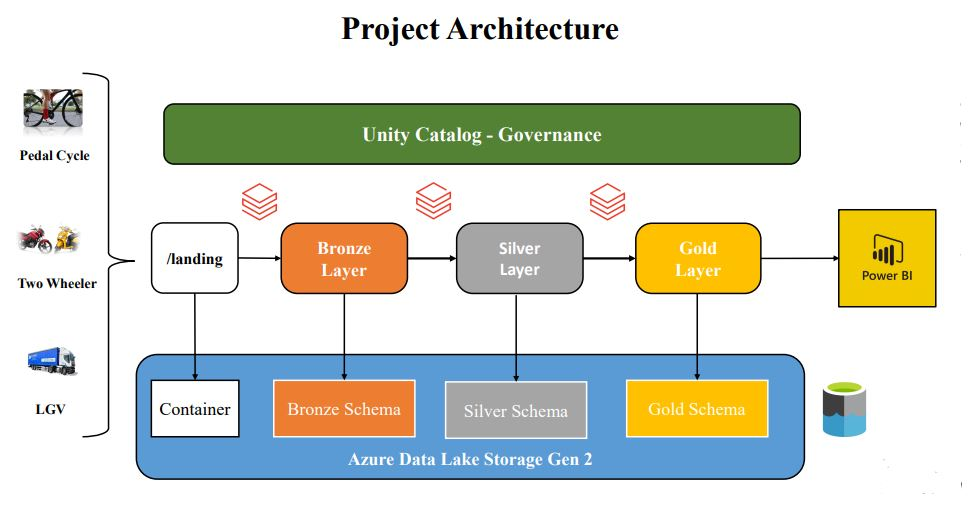

# Databricks-Traffic-Project
An End to end Azure Databricks ETL Pipeline to implement Modern DataLakehouse Medallion Architecture to process data through multiple staging layer and refine datasets to deliver business data ingestion solution.
Used Bronze, Silver, Gold Data layer deployed on ADLS v2 at backend and administeration using Unity Catalog as frontend.

